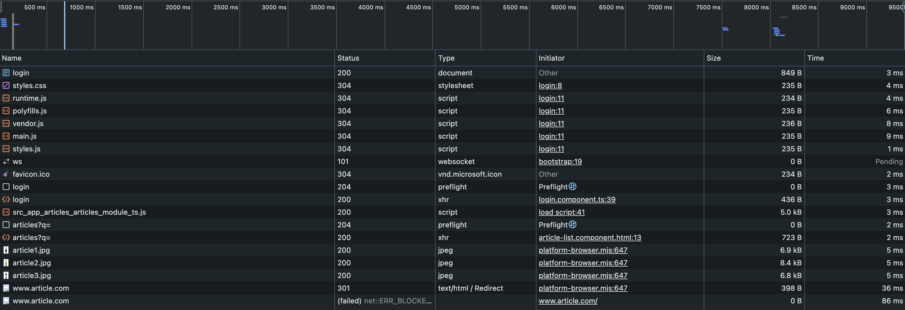

# Front End Avanzado - PEC7

• Login UOC: isaacblanco
• Nombre y apellidos del alumno: Isaac Blanco Peco

Breve descripción de lo realizado en esta PEC:

## Pregunta 1 - Teoría

Leer documentación

### Dificultades

Ninguna. Leer, entender, y aprovechar que estoy en la asignatura de FEA (front end avanzado) para rellenar las cuestiones.

### Mejoras realizadas

No aplica

## Pregunta 2 - Práctica

Copiados los ficheros

```
npm i
npm start
```

Hello world!

Compruebo que las rutas funcionan:

```
http://localhost:3000/api/articles
```

El get funciona sin problemas, devolviendo 3 articulos. Los post relacionados con el usuario, se modificarón.

**NOTA: empece por mi ejercicio, pero decidí esperar a tener la solución oficial para fijarme como se hace y trabajar sobre ella.**

### Dificultades

Como siempre, tengo que tener cuidado en mis directorios, porque requiere sudo.

Respecto al API, la documentación del enunciado de la práctica presenta mal las rutas (se comento en el foro).

En lugar de /auth/login es /api/user/login
En lugar de /auth/register es /api/user/register

Y no es cierto que "se asigna la contraseña “SECRET” a todos los usuarios.", si esta se especifica, hay que usar la especificada.

### Mejoras realizadas

Espero que mi aportación en el foro evite problemas a la gente que lo este realizando.

Mejoras en la página

- Se han mejorado las apariencias de las páginas, no mucho, pero un trabajo honesto.
- El formulario de login lleva al register y viceversa.
- El menú es un poco reactivo, si estas logado, no se muestra ni 'login' ni 'register'
- Se ha incluido en el detalle del articulo el volver a la lista.
- Si bien la estructura de ficheros se ha cambiado para que tenga algo más de lógica, es mejorable, y no sigue el formato propuesto.
- No se ha controlado la url de la imagen, ya que venia dada en la solución.
- No soy partidario de incluir el template en el ts y se han generado el html y el css para el listado.
- He dejado siempre en el menú la opción "Nuevo articulo reactive", para que se vea que cuando no se esta logado, que no se puede acceder.
- Cuando ya se esta logado, automaticamente redirige al /articles/list

### Problemas

El menú no siempre se refresca cuando debe, las opciones de 'Logout' vs. 'Login' y 'register', en caso de duda, refrescar la pantalla.

#### Lazy loading

Se han creado dos ficheros de carga: articles.module.ts y auth-routing.module.ts que permiten tratarlos independientemente.

Aquí se observa la carga en dos fases: cuando no se esta logado y despues:


